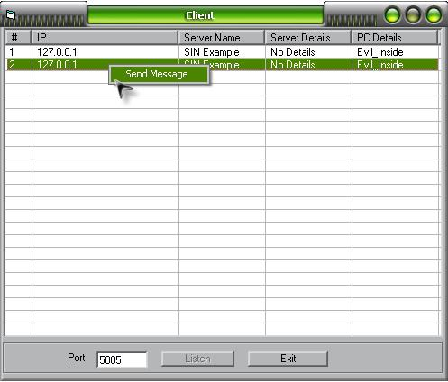



## Multiconnections \( SIN \) Winsock Example

### Description

This is a Basic example on how to work with Winsock

and Multiconnections ( SIN )
 
### More Info
 

             |
---                |---
**Submitted On**   |2006-04-27 10:30:02
**By**             |[iamNoble](https://github.com/Planet-Source-Code/PSCIndex/blob/master/ByAuthor/iamnoble.md)
**Level**          |Beginner
**User Rating**    |5.0 (15 globes from 3 users)
**Compatibility**  |VB 5\.0, VB 6\.0
**Category**       |[Internet/ HTML](https://github.com/Planet-Source-Code/PSCIndex/blob/master/ByCategory/internet-html__1-34.md)
**World**          |[Visual Basic](https://github.com/Planet-Source-Code/PSCIndex/blob/master/ByWorld/visual-basic.md)
**Archive File**   |[Multiconne1990074272006\.zip](https://github.com/Planet-Source-Code/iamnoble-multiconnections-sin-winsock-example__1-65122/archive/master.zip)

